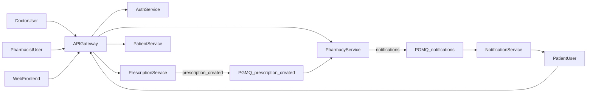
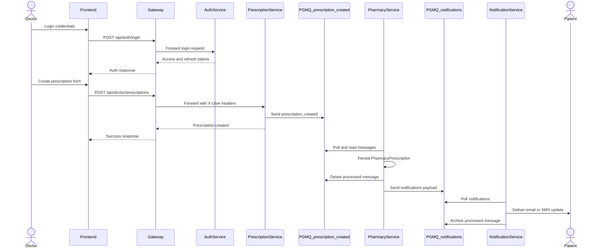

# CS4135 - Software Architectures Project

**22356843 Shane Hanley**  
**22348573 Niall Roche**  
**22353364 Darragh O' Sullivan**  
**22345272 Joseph Fitzgerald**

Department of Computer Science and Information Systems  
Faculty of Science and Engineering  
University of Limerick

---

## Table of Contents
1. Introduction of the Project  
2. Contribution  
3. Strategic Architecture Development  
4. Design of Architecture based on Model Driven Design  
5. Event Storming and Domain Storytelling  
6. Architecture Implementation  
7. References  
8. Appendices (Optional)

---

## 1. Introduction of the Project

### 1.1 Enterprise Domain and Problem Space
The project addresses digital prescription lifecycle management across doctors, pharmacies, and patients. In a traditional flow, prescription handling is fragmented: doctors issue prescriptions, pharmacies process them with limited upstream integration, and patients often receive delayed or inconsistent status communication. This leads to operational inefficiency and poor patient experience.

The implemented platform solves this through secure role-based workflows, explicit service ownership boundaries, and asynchronous event-driven propagation for cross-context actions. The system supports core user journeys: doctor prescription creation, pharmacy processing and status transitions, and notification delivery to patients.

### 1.2 Goals of the Architecture Effort
The architecture was designed with the following goals:
- Deliver secure and centralized access control while preserving service autonomy.
- Decompose domain responsibilities into bounded contexts with clear ownership.
- Support asynchronous inter-service workflows using durable queue-based messaging.
- Provide deployable parity and reproducible environment setup via Docker Compose.
- Enable extensibility for future contexts without coupling the core prescription flow.

### 1.3 Bounded Context Summary (In Scope)
The report scope includes:
- **Auth Context**: identity lifecycle and token management.
- **Gateway Context**: entry-point routing, token verification, and claim propagation.
- **Prescription Context**: doctor-originated prescription creation and retrieval.
- **Pharmacy Context**: pharmacy queue intake, status transitions, and operational state.
- **Patient Context**: patient profile and refill-request schema baseline.
- **Notification Context**: queued notification dispatch and retry semantics.
- **Frontend Context**: role-based UI and API client orchestration.

**Out of scope for this submission:** Billing, Inventory, and Analytics services are present as scaffolds in the repository but intentionally excluded from the architecture narrative and assessment evidence.

### 1.4 Chosen Architectural Style
The implementation follows a **microservices architecture** with:
- an **API Gateway** as single ingress,
- **bounded-context services** with independent schemas and migrations,
- **event-driven integration** using PostgreSQL PGMQ queues,
- and **role-based frontend workflows** through a separate React application.

This hybrid of request/response and async messaging supports strong consistency within each service boundary and eventual consistency across service boundaries.

---

## 2. Contribution

| Team Member | Contribution Summary | Estimated Share |
|---|---|---|
| Shane Hanley | Designed, implemented, and documented auth service. | 25% |
| Niall Roche | Designed, implemented, and documented prescription service. | 25% |
| Darragh O' Sullivan | Designed, implemented, and documented pharmacy service. | 25% |
| Joseph Fitzgerald | Designed, implemented, and documented gateway and notification service. | 25% |

---

## 3. Strategic Architecture Development

### 3.1 Method and Steps
The architecture evolved through an explicit sequence of strategic decisions:

1. **Domain decomposition**  
   The healthcare prescription domain was decomposed into identity, prescribing, dispensing, patient-facing, and notification responsibilities.

2. **Bounded context and data ownership definition**  
   Each core context was mapped to an independently deployable service with dedicated schema ownership (e.g., `auth_svc`, `prescription_svc`, `pharmacy_svc`, `patient_svc`).

3. **Security and ingress centralization**  
   A Spring Cloud Gateway layer was introduced as the single API boundary for routing, JWT verification, and user claim forwarding.

4. **Asynchronous workflow design**  
   Inter-context workflow propagation was implemented via PGMQ queues (`prescription_created`, `notifications`) to decouple producer and consumer runtime concerns.

5. **Delivery and runtime standardization**  
   Docker Compose unified build/run behavior across services and frontend for reproducible local deployment and demonstration.

### 3.2 Strategic Trade-offs
- **Gateway-centric security vs embedded auth in every service**  
  Centralizing JWT verification at gateway simplifies downstream services but introduces a critical-path dependency on gateway reliability.
- **Queue-based eventual consistency vs synchronous orchestration**  
  Asynchronous messaging improves resilience and decoupling but requires idempotency and explicit handling of delayed visibility.
- **Context autonomy vs cross-service discoverability**  
  Independent schemas and teams improve maintainability but increase need for clear contracts and traceability tables.

### 3.3 Strategic Outcome
The resulting architecture achieves cohesive business capability partitioning, secure interaction boundaries, and reliable cross-context event flow suitable for incremental extension and team-based development.

---

## 4. Design of Architecture based on Model Driven Design (10 Marks)

### 4.1 Bounded Contexts, Ownership, and Dependencies

| Bounded Context | Primary Responsibility | Owner Service | Dependency Notes |
|---|---|---|---|
| Auth | Registration, login, refresh, user profile identity | `auth-service` | Trusted by gateway token validation and all secured APIs |
| Gateway | API ingress, route partitioning, auth enforcement | `gateway-service` | Forwards user claims via `X-User-Id` and `X-User-Role` |
| Prescription | Doctor-driven prescription creation and status query | `prescription-service` | Publishes `prescription_created` queue events |
| Pharmacy | Intake and lifecycle progression of prescriptions | `pharmacy-service` | Consumes `prescription_created`, publishes `notifications` |
| Notification | Delivery orchestration (email/SMS processor paths) | `notification-service` | Consumes `notifications` queue with retry window |
| Patient | Patient profile and refill-request data model baseline | `patient-service` | Routed via gateway, protected by role-based auth |
| Frontend | Role-specific workflows and API session handling | `web-frontend` | Uses gateway as only backend API endpoint |

#### Context Map (In-Scope Services)

### 4.2 Ubiquitous Language and Key Capabilities

| Context | Ubiquitous Language | Key Capability |
|---|---|---|
| Auth | User, Role, Access Token, Refresh Token, Active User | Secure identity lifecycle and role claim issuance |
| Prescription | Prescription, Doctor, Patient, Dosage, Refills, Status | Create and list doctor-owned prescriptions |
| Pharmacy | Intake Queue, Pharmacy Prescription, Rejection Reason, Operational Status | Consume prescriptions and enforce status transition rules |
| Notification | Notification Message, Channel, Visibility Timeout, Archive | Scheduled dispatch with retry semantics |
| Patient | Patient Profile, Refill Request, Delivery Preference | Persist patient profile and refill request state |
| Gateway | Public Route, Protected Route, Forwarded Claims | Access boundary and policy enforcement |

### 4.3 DDD Building Blocks and UML Alignment
- **Entities**
  - `User` in Auth (`auth_svc.users`).
  - `Prescription` in Prescription (`prescription_svc.prescriptions`).
  - `PharmacyPrescription` in Pharmacy (`pharmacy_svc.pharmacy_prescriptions`).
- **Repositories**
  - `UserRepository`, `PrescriptionRepository`, `PharmacyPrescriptionRepository` and supporting repositories.
- **Domain Services**
  - `AuthService`, `PrescriptionService`, `PharmacyService`, `NotificationProcessor` + `NotificationScheduler`.
- **Domain Events**
  - `prescription_created` and `notifications` queue messages via `PgmqService`.
- **DTO/Contract Models**
  - Auth and prescription DTO records define explicit request/response contracts.

These map cleanly to UML class-level concepts (entities, services, repositories) and service interaction sequence views (gateway -> prescription -> queue -> pharmacy -> queue -> notification).

### 4.4 Aggregate Design and Consistency
- **Prescription Aggregate Root**: `Prescription`  
  Governs medication details, doctor ownership, and initial status creation (`NEW`).
- **Pharmacy Aggregate Root**: `PharmacyPrescription`  
  Maintains a pharmacy-local operational projection with unique `prescriptionId` to prevent duplicate materialization.
- **Auth Aggregate Root**: `User`  
  Preserves identity invariants including unique email and role assignment.

**Consistency model**:
- **Strong consistency** within each service transaction boundary.
- **Eventual consistency** across contexts through queue publication and polling.

### 4.5 Inter-Context Contracts and Anti-Corruption Strategy

#### Synchronous Contracts (Gateway-Routed HTTP)
- `/api/auth/**` -> auth-service
- `/api/doctor/**` -> prescription-service
- `/api/pharmacy/**` -> pharmacy-service
- `/api/patients/**` -> patient-service

| API Prefix | Source | Target | Contract Purpose | Access Policy |
|---|---|---|---|---|
| `/api/auth/**` | Frontend/Gateway | Auth Service | Login, register, refresh, authenticated profile | Public for login/register/refresh, auth required for protected endpoints |
| `/api/doctor/**` | Frontend/Gateway | Prescription Service | Doctor prescription create/list/status flows | JWT required with forwarded role/user claims |
| `/api/pharmacy/**` | Frontend/Gateway | Pharmacy Service | Pharmacy queue view and status transition updates | JWT required with forwarded role/user claims |
| `/api/patients/**` | Frontend/Gateway | Patient Service | Patient profile and refill-related flows | JWT required with forwarded role/user claims |

#### Asynchronous Contracts (PGMQ)
- Producer: Prescription service sends `prescription_created` payload with prescription and patient metadata.
- Consumer/Producer: Pharmacy service consumes `prescription_created`, then emits normalized `notifications` payload.
- Consumer: Notification service polls and archives processed `notifications` messages.

| Queue | Producer | Consumer | Payload Core Fields | Reliability Mechanism |
|---|---|---|---|---|
| `prescription_created` | Prescription Service | Pharmacy Service | `prescriptionId`, `doctorId`, `patientId`, `patientEmail`, `pharmacyId`, `medicationName`, `dosage`, `quantity` | Visibility timeout read, explicit delete after processing |
| `notifications` | Pharmacy Service | Notification Service | `channel`, `type`, `recipient`, `subject`, `body` | Visibility timeout retry and archive on success |

#### Anti-Corruption Strategy
Each consumer maps incoming payloads into local entities/structures before persistence. No cross-context table sharing is used, and each context preserves schema autonomy and local model semantics.

### 4.6 UML/DDD Compliance Statement
The implementation demonstrates strategic DDD (bounded contexts and context boundaries) and tactical DDD (entities, repositories, domain services, domain events). Service layering (controller-service-repository) and explicit DTO contracts are consistent with UML/DDD-friendly model extraction for class and sequence diagrams.

---

## 5. Event Storming and Domain Storytelling (10 Marks)

### 5.1 Session Timeline, Participants, and Tools
Event-storming outcomes were captured through iterative refinement of service boundaries and event contracts in code and README artifacts. The design iteration concentrated on end-to-end prescription flow from creation to patient notification.

- **Participants**: project team members across gateway, auth, prescription, pharmacy, and notification workstreams.
- **Tools**: repository documentation, service contracts, queue migrations, and integration/unit tests as evidence artifacts.
- **Timeline pattern**: initial domain decomposition -> contract definition -> implementation validation via tests.

### 5.2 Domain Flow: Actors, Commands, Events, Policies, Hotspots

**Actors**
- Doctor
- Pharmacist
- Patient
- System scheduler/worker

**Commands**
- Login/Register
- Create Prescription
- Update Prescription Status
- Poll Notification Queue
- Dispatch Notification

**Domain Events**
- `prescription_created`
- `notifications` (status-driven communication events)

**Policies**
- Only authenticated requests access protected `/api/**` paths.
- Gateway must forward validated `X-User-Id` and `X-User-Role` to downstream contexts.
- Rejected pharmacy status requires non-empty rejection reason.
- Processed notification messages are archived; failed ones reappear after visibility timeout.

**Hotspots and Uncertainties**
- Contract naming consistency across docs and implementation.
- Patient context depth is schema-complete but service logic maturity remains lower than core workflow contexts.
- Explicit circuit-breaker/fallback patterns are not yet implemented.

### 5.3 Translation of Event-Storming Insights to Architecture Decisions
- Introduced a queue-first inter-context workflow to avoid direct service coupling.
- Added deduplication pattern in pharmacy context using unique `prescriptionId`.
- Preserved gateway as centralized policy boundary for security consistency.
- Structured notification handling around polling + visibility timeout + archive semantics.
- Preserved extensibility by keeping out-of-scope contexts isolated from the assessed core flow.

### 5.4 Domain Storytelling Narrative
1. A doctor authenticates through the gateway-auth path and receives access credentials.
2. The doctor submits a prescription via `/api/doctor/prescriptions`.
3. Prescription service persists the aggregate and publishes `prescription_created`.
4. Pharmacy service scheduler polls `prescription_created`, materializes a local pharmacy aggregate, and acknowledges queue consumption.
5. A pharmacist updates prescription status through `/api/pharmacy/prescriptions/{id}/status`.
6. Pharmacy service emits a `notifications` message with channel, recipient, subject, and body.
7. Notification scheduler polls the queue, dispatches through notification processor logic, and archives successful messages.
8. On failure, the message is retried after visibility timeout, preserving delivery robustness.

Outcome: bounded contexts remain autonomous while patient-facing communication is delivered through an event-driven, traceable flow.

### 5.5 Event Sequence View

---

## 6. Architecture Implementation (10 Marks)

### 6.1 Service-by-Service Implementation Summary

| Service | Technology Stack | DDD/Architecture Alignment | Build/Run | Test Evidence |
|---|---|---|---|---|
| gateway-service | Spring Boot, Spring Cloud Gateway, JWT libs | Context map + policy enforcement boundary | Included in `docker compose up --build` | `GatewayRoutingIntegrationTest` validates forwarding and header propagation |
| auth-service | Spring Boot, Spring Security, JPA, Flyway, PostgreSQL | Owns user identity aggregate and role model | Included in compose stack | `AuthSecurityIntegrationTest` validates auth/role behavior |
| prescription-service | Spring Boot, JPA, Flyway, PostgreSQL, PGMQ via JDBC | Owns prescription aggregate and publishes domain events | Included in compose stack | `PrescriptionServiceTest` validates event publication on create |
| pharmacy-service | Spring Boot, JPA, scheduler polling, PGMQ | Owns pharmacy projection aggregate and lifecycle transitions | Included in compose stack | `PharmacyServiceTest` validates consumption, rules, and notification payload mapping |
| patient-service | Spring Boot, Flyway/PostgreSQL schema baseline | Owns patient profile/refill-request persistence boundary | Included in compose stack | Structure exists; limited dedicated automated tests |
| notification-service | Spring Boot, scheduler, JDBC messaging, notification processor | Event consumer with retry/archive semantics | Included in compose stack | Processing logic testability present via scheduler/processor separation |
| web-frontend | React 18, Vite 5, Redux Toolkit, Axios, Router | Role-based client workflows aligned to bounded contexts | `npm run dev` or Docker | No dedicated automated frontend tests in current repository |

### 6.2 Configuration and Environment Management
- **Central runtime orchestration**: `docker-compose.yml` defines service ports, dependencies, and shared environment.
- **Environment variable externalization**: service endpoints and credentials are configured through `.env` patterns.
- **Database and migration control**: each service applies context-local Flyway migrations.
- **Notification operational settings**: cron frequency, batch size, and visibility timeout are externally configurable.

### 6.3 Versioning and Change Management
- Flyway scripts (`V1__...`, `V2__...`, `V3__...`, etc.) provide schema evolution traceability.
- Service-level code boundaries align with modular Maven project structure.
- Event contracts are represented in both code and migrations, improving auditability across revisions.

### 6.4 Resilience Patterns and Failure Handling
Implemented patterns:
- Queue visibility timeout and scheduled re-polling for transient failures.
- Archive/delete semantics to prevent reprocessing on successful completion.
- Controlled exception handling in queue consumers to avoid worker crash loops.

Partially implemented / not explicit:
- Circuit breaker and fallback libraries (e.g., Resilience4j) are not currently configured.
- Explicit dead-letter queue strategy is not formalized in current implementation.

### 6.5 Traceable End-to-End Scenario
**Scenario:** `Login -> Create Prescription -> Pharmacy Intake -> Status Update -> Notification Dispatch`

Evidence path:
1. Gateway routes and JWT checks authorize role-aware requests.
2. Prescription service writes aggregate and publishes `prescription_created`.
3. Pharmacy poller reads queue and persists local operational record.
4. Pharmacy status update publishes `notifications`.
5. Notification scheduler consumes and archives successful dispatches.

This scenario is represented by service code paths and reinforced by unit/integration tests in core contexts.

### 6.6 Quality Gaps and Improvement Backlog
To reach production-grade architecture maturity:
- Add explicit contract tests for inter-service queue payload compatibility.
- Add end-to-end integration tests across gateway + queue + notification flows.
- Add frontend automated tests for role-based route and API behavior.
- Introduce resilience library support for circuit breakers/timeouts/retries on synchronous calls.
- Formalize architecture decision records (ADR) and event contract versioning.

---

## 7. References

1. Evans, E. (2003). *Domain-Driven Design: Tackling Complexity in the Heart of Software*. Addison-Wesley.
2. Richardson, C. (2018). *Microservices Patterns*. Manning Publications.
3. Newman, S. (2021). *Building Microservices* (2nd ed.). O'Reilly Media.
4. Spring. (2026). Spring Boot Reference Documentation. [https://docs.spring.io/spring-boot/docs/current/reference/html/](https://docs.spring.io/spring-boot/docs/current/reference/html/)
5. Spring. (2026). Spring Cloud Gateway Reference. [https://docs.spring.io/spring-cloud-gateway/reference/](https://docs.spring.io/spring-cloud-gateway/reference/)
6. Supabase. (2026). PGMQ Queue Documentation. [https://supabase.com/docs/guides/queues/pgmq](https://supabase.com/docs/guides/queues/pgmq)
7. Docker. (2026). Docker Compose Specification. [https://docs.docker.com/compose/](https://docs.docker.com/compose/)

---

## 8. Appendices (Optional)

Suggested appendix material for final PDF submission:
- Runtime screenshots of gateway, prescription, pharmacy, and notification logs during end-to-end flow.
- Sequence and class diagrams generated from implemented services.
- Test execution outputs for gateway/auth integration tests and core service unit tests.
